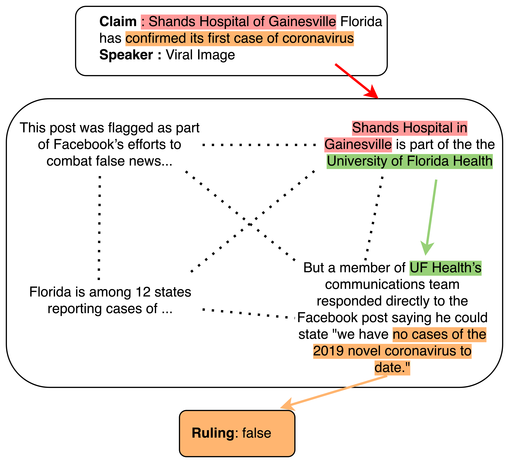

# PolitiHop

This repo contains the **PolitiHop** dataset introduced in the paper ["Multi-Hop Fact Checking of Political Claims"](https://arxiv.org/pdf/2009.06401.pdf) and the accompanying experiments.

<p align="center">
  
</p>

In this project, we study how to perform more complex claim verification on naturally occurring claims with multiple hops over evidence chunks. We first construct a small annotated dataset, **PolitiHop**, of reasoning chains for claim verification. We then compare the dataset to other existing multi-hop datasets and study how to transfer knowledge from more extensive in- and out-of-domain resources to PolitiHop. We find that the task is complex, and achieve the best performance using an architecture that specifically models reasoning over evidence chains in combination with in-domain transfer learning.

## Citation
```bib
@article{ostrowski2020multi,
  title={Multi-Hop Fact Checking of Political Claims},
  author={Ostrowski, Wojciech and Arora, Arnav and Atanasova, Pepa and Augenstein, Isabelle},
  journal={arXiv preprint arXiv:2009.06401},
  year={2020}
}
```

## Dataset format

Each row in the dataset splits represents one instance and contains the following tab-separated columns:

- article_id - article id corresponding to the id of the claim in the LIAR dataset
- statement	- the text of the claim
- author - the author of the claim
- ruling - a comma-separated list of the sentences in the Politifact ruling report (this excludes sentences from the summary in the end)
- url_sentences - a comma-separated list of ids of the sentences with a corresponding source url(s)
- relevant_text_url_sentences	- a comma-separated list of ids of the sentences with a corresponding source url(s) that are actually relevant to the selected evidence sentences
- politifact_label - label assigned to the claim by PolitiFact fact-checkiers
- annotated_evidence - a json dict of the evidence chains (keys) and the sentences that belong to the chain (value, which is a list of sentence ids from the ruling)
- annotated_label - label annotated by annotators of PolitiFact - True, False, Half-True
- urls - a comma-separated list of source urls used in the corresponding PolitiFact article
- annotated_urls - a json dict mapping sentence ids to the corresponding urls ids. One sentence can have multiple urls

## IN PROGRESS: The code for the experiments is currently being prepared!
